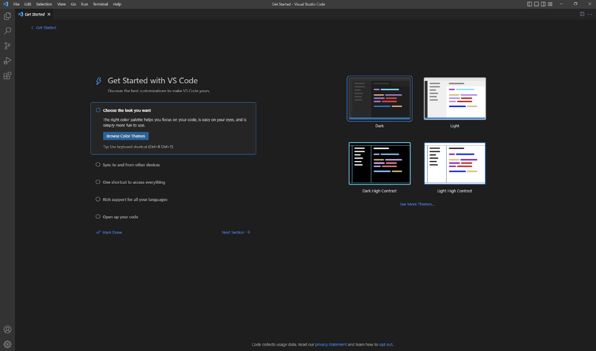
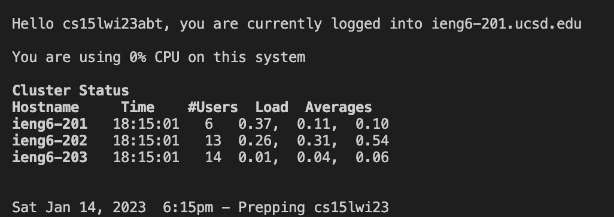
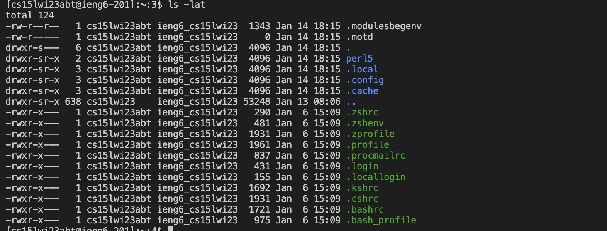

## **Step 1: Installing VScode**  
Go to [https://code.visualstudio.com/](https://code.visualstudio.com/) and press download for your operating system (Mac, Windows, Linux). After it is done installing open it and you should see something like this:  
  
## **Step 2: Remotely Connecting**  
If you are using windows download [Git For Windows](https://gitforwindows.org/) and press Ctrl + Shift + P in VScode. Then type Select Default Profile and then select Git Bash.  
In the terminal enter:  
$ ssh cs15lwi23zz@ieng6.ucsd.edu  
Instead of zz enter the letters from your account id. After it will prompt a (yes/no); type yes in the terminal and hit enter. Then enter your password when it asks. It will not show that you are typing.  
If everything was done right you should get something like this:  
 
## **Step 3: Trying Some Commands**  
Try some commands such as:  
cd ~, cd, ls, ls -lat, ls -a, ls <directory>, cp /home/linux/ieng6/cs15lwi23/public/hello.txt ~/, cat /home/linux/ieng6/cs15lwi23/public/hello.txt  
Type exit into the terminal to log out of the remote servers and try the commands again to see the difference.
Here is an example of what you would see when using the ls -lat command:  

