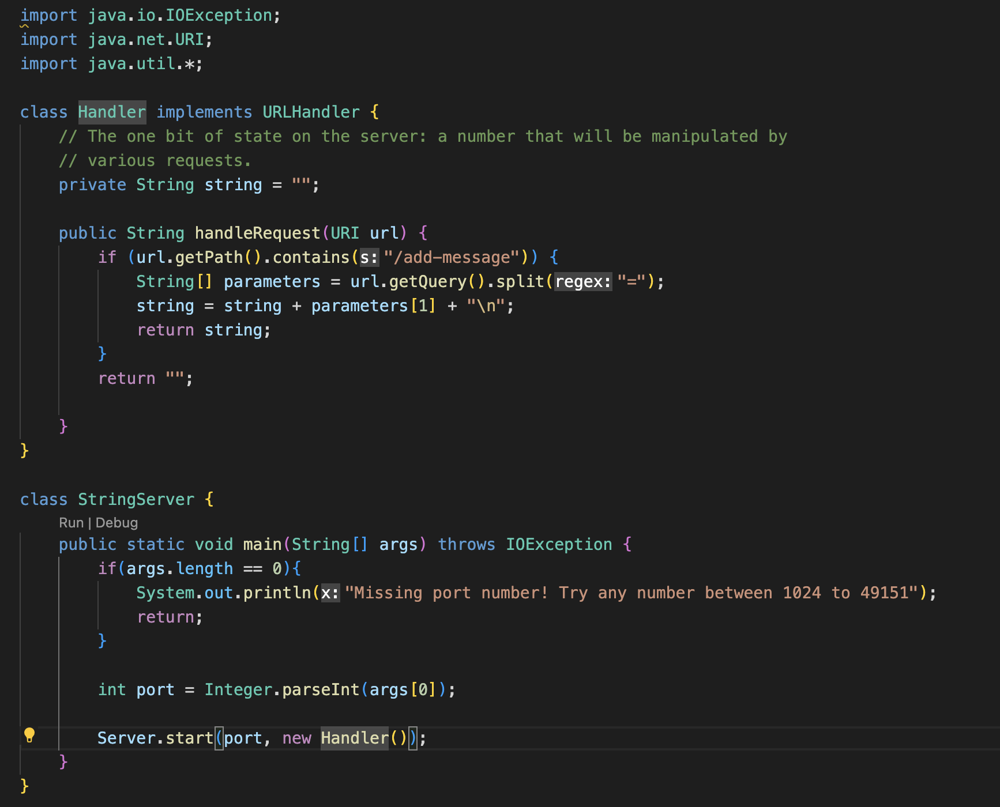
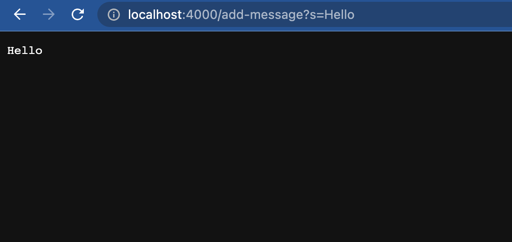
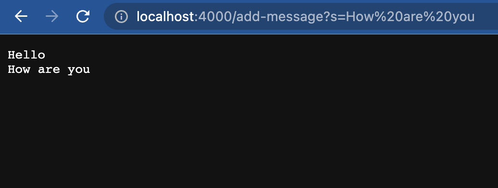
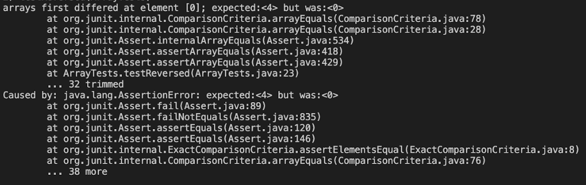

##**Part 1** 
**Code for `StringServer`:** 
  
**Screenshots of using `/add-message`:** 
  
For the first screenshot the method `handleRequest()` is called and it has an argument called url which is of type `URI`. The method changes a field in the class called string which is of type `String`. The variable, string, has `"Hello"` concatenated to it. Also a `"\n"` is concatenated after the String. This allows for the next added message to be on another line.
  
For the second screenshot the method `handleRequest()` is called and it has an argument called url which is of type `URI`. The method changes a field in the class called string which is of type `String`. The variable, string, has `"How are you"` concatenated to it. Also a `"\n"` is concatenated after the String. Since it is being concatenated both "Hello" and "How are you" are shown on the screen. 
##**Part 2** 
For the method `reversed()`:
Failure-inducing input:
```
int[] input2 = {1, 2, 3, 4 };
assertArrayEquals(new int[]{ 4, 3, 2, 1}, ArrayExamples.reversed(input2));
```
Passing input:
```
int[] input1 = { };
assertArrayEquals(new int[]{ }, ArrayExamples.reversed(input1));
```
Symptom:
 

The Bug:
Before
```
static int[] reversed(int[] arr) {
    int[] newArray = new int[arr.length];
    for(int i = 0; i < arr.length; i += 1) {
      arr[i] = newArray[arr.length - i - 1];
    }
    return arr;
  }
```
After
```
static int[] reversed(int[] arr) {
    int[] newArray = new int[arr.length];
    for(int i = 0; i < arr.length; i += 1) {
      newArray[i] = arr[arr.length - i - 1];
    }
    return newArray;
  }
```
The issue was that the places of `arr` and `newArray` were flipped when in the for loop and then `arr` was being returned. This led to `arr` being overwritten as a reverse of the `newArray`. Instead we wanted to reverse `arr` so by flipping the variables the correct output was obtained. 

##**Part 3**  
Something that I learned from lab 2 was how to us urls as an input to my code. I also learned how to run a server and then use those urls to affect the server.
